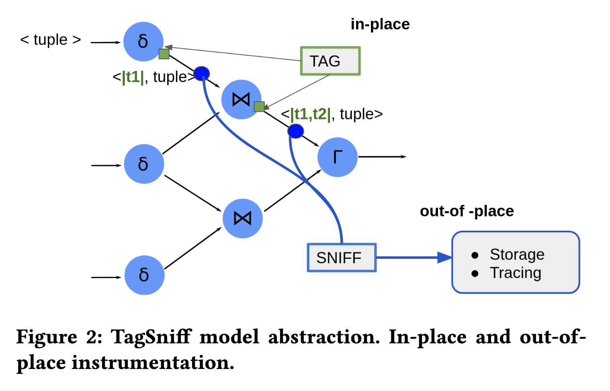

# BDAPRO Project: Data Provenance with HackIt

This repository is from the research conducted in the Database Management System Master at the TU
Berlin, in the frame of the course BDAPRO. The idea of the project is to design and analyze 
a system that can help in big data debugging. This System is called **HackIt**, and it is an ongoing research
project for data debugging and data provenance. HackIt is based in the previous research 
[TagSniff: Simplified Big Data Debugging for Dataflow Jobs](https://dl.acm.org/doi/10.1145/3357223.3362738)

To know more about the BDAPRO project and its research please refer to the paper in this repository: `DataProv___BDAPRO.pdf`

## Project structure

In this project we make progress leveraging the TagSniff model, a general compelling abstraction
for debugging and ease provenance capture. As you can appreciate in Figure 2, TagSniff is based
on two powerful primitives, `TAG` and `SNIFF` that operate in the
debug tuple. The logic behind this model is flexible enough to allow
users to instrument their dataflow applications for their analysis
requirements. In this example we have a DAG (Direct Acyclic Graph) and the operators are operating
in the data flow.

For that, HackIt project is wrapping the DataSet API of Apache Flink and also Apache Spark. The
the idea is to use these wrappers to place the Tag and Sniff operators for the debugging task.

The main component of HackIt is **Hackit-core**. Here you can find definitions
for the tagger, sniffer, the tuple and the wrapper.

The **hackit-flink** and **hackit-spark** are wrappers for the hackit-core modules that enable
hackit to run in Apache Flink and Apache Spark ecosystem.

**hackit-shipper** is the module in charge of the **sender** and the **receiver** to consume
and produce data.

The **hackit-experiment** is a module to run and test HackIt

### Dependencies
* Java 1.8
* scala 2.11
* **hackit-shipper**:
  * rabbitmq 5.7.3
  * Apache Kafka 2.3.0
* **hackit-flink**:
  * flink-java 1.10.1
  * flink-streaming-java 1.10.1
  * flink-hadoop-compatibility_2.11 1.11.0
  * chill-protobuf 0.7.6
  * log4j 2.11.0
* **hackit-spark**:
  * spark-core 2.4.0
  * hadoop-common 2.6.5

## Project testing

The current version of the project is a prototype of the early stage of the HackIt development.
Many of the designed HackIt functions are just the blueprint. Nevertheless, this repository
includes a simple test to run experiments and test the Tagger and Sniffer operators.

In the **hackit-experiments** module you can find a Greep experiment. To run it, just run the
java file `Main.java` in the hackit-experiment module.

The repository with the experiment carried out in the project for the course BDAPRO in
the Master of Data Management System in TU Berlin is not implemented in this repository
due to rights protection. If you want to know more about HackIt project and the experiment
described in the paper, please contact the [authors](https://www.linkedin.com/in/salvador-vigo/)

### Dataset

For the Greep experiment testing, you can use any text file. Include the path of the text
file in the `Main.java` file where it corresponds.